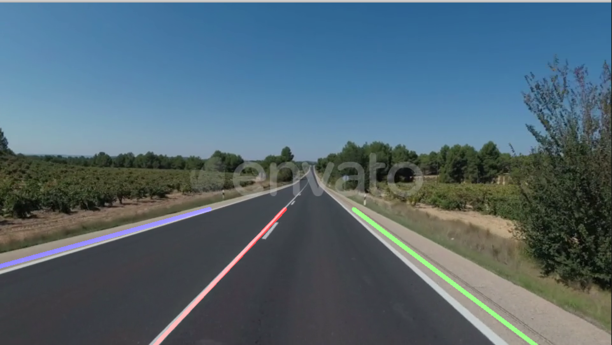

<h1> Primitive test code for finding lanes from continuous road video input </h1>

The code in lanes.py converts each frame of the input video to grayscale, darkening it and applying a Gaussian filter to smooth the image. 
Next, the Canny Edge Detector retrieves the binary image containing the edges as defined by the pixel intensity parameters.

Next, the region of interest in the frame is retrieved such that the code doesn't interpret parts of the road too far ahead.
Once the region is retrieved, the Hough transform is applied to the binary image such that any functions of straight lines of a specified length are found.
At most, the lines representing the two hard shoulder lines and the median in between can be obtained, as pictured below



A moderately successful attempt is also made at making the algorithm robust to the interference of incoming traffic. The available lanes are then overlayed onto the original video data.

To run a test sample, cd into the directory and run 

```python
python lanes.py test4.mp4
```
